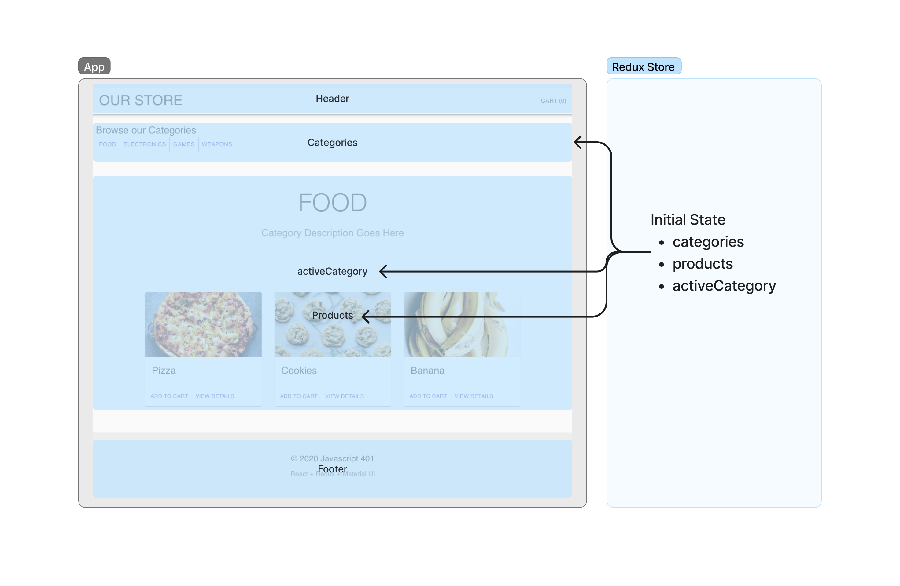
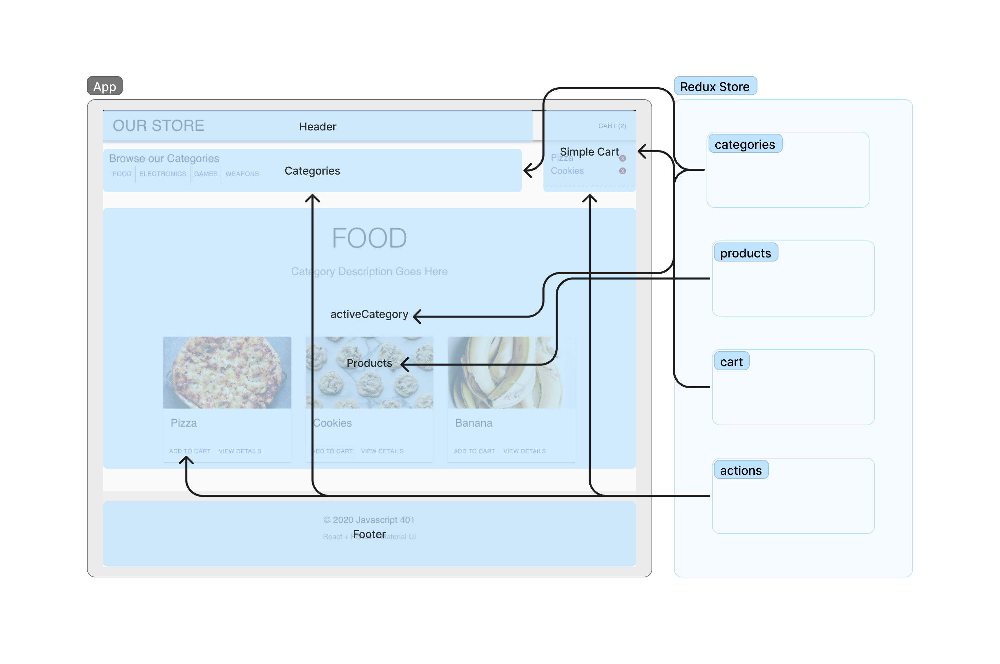

# LAB - Class 36 - 39

## Project: Application State with Redux

### Author: Donna Ada

### Problem Domain

- Virtual Store Phase 1: For this assignment, you will be starting the process of creating an e-Commerce storefront using React with Redux, coupled with your live API server.
- Virtual Store Phase 2: Continue work on the e-Commerce storefront, breaking up the store into multiple reducers and sharing functionality/data between components.

### Links and Resources

### Collaborators

Ryan Gallaway - Lecture and Code Review

#### Features / Routes

- Virtual Store Phase 1: Display List of Categories from state, and show list of products associated with state.
- Virtual Store Phase 2: Clicks the “Add to Cart” button on any product, Sees a list of all products in the side menu, Clicks the delete button on an item and sees the item removed.

#### Tests (Coming Soon)

- Run `npm test` to see tests running.

#### Wireframes

